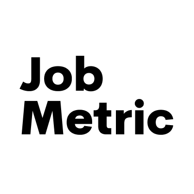

[![Contributors][contributors-shield]][contributors-url]
[![Forks][forks-shield]][forks-url]
[![Stargazers][stars-shield]][stars-url]
[![MIT License][license-shield]][license-url]
[![LinkedIn][linkedin-shield]][linkedin-url]

[contributors-shield]: https://img.shields.io/github/contributors/jobmetric/laravel-flow.svg?style=for-the-badge
[contributors-url]: https://github.com/jobmetric/laravel-flow/graphs/contributors
[forks-shield]: https://img.shields.io/github/forks/jobmetric/laravel-flow.svg?style=for-the-badge&label=Fork
[forks-url]: https://github.com/jobmetric/laravel-flow/network/members
[stars-shield]: https://img.shields.io/github/stars/jobmetric/laravel-flow.svg?style=for-the-badge
[stars-url]: https://github.com/jobmetric/laravel-flow/stargazers
[license-shield]: https://img.shields.io/github/license/jobmetric/laravel-flow.svg?style=for-the-badge
[license-url]: https://github.com/jobmetric/laravel-flow/blob/master/LICENSE.md
[linkedin-shield]: https://img.shields.io/badge/-LinkedIn-blue.svg?style=for-the-badge&logo=linkedin&colorB=555
[linkedin-url]: https://linkedin.com/in/yourlinkedinusername

<!-- PROJECT LOGO -->
<br />
<div align="center">
  <a href="https://github.com/jobmetric/laravel-flow">
    
  </a>

<h3 align="center" style="color: red;">Workflow for laravel</h3>

  <p align="center" style="color: cadetblue;">
    This package is for creating different workflows in different Laravel projects
  </p>
</div>

# <span style="color: aqua;">About The Project</span>

<br>

[product-screenshot]: images/banner-workflow.png
[![product-screenshot][product-screenshot]](https://example.com)

### <span style="color: lightblue;">Make Work Flow your Way</span>

> Workflows represent your team’s process and control how people progress your project’s work.
Here, you can add statuses, which appear as drop zones for the cards on your project’s board.
You can create pathways between statuses called transitions, and automate repetitive actions using rules.


### <span style="color: lightblue;">What is Workflow?</span>

> Suppose that in a human resource system we want to make a request for a salary increase, this request must go through a series of procedures for final approval.
For example, first the department manager, then the company manager, and finally the finance manager must approve this request.
This is a flow. When this request is placed at any stage, it means that we are in one state, and confirmation or rejection causes us to go to another state, that is, a transition occurs.
This transition can be accompanied by a series of tasks that must happen, for example, if the financial unit approves, an SMS must be sent to the user.
Each flow has only one start state and at least one end state. That is, a flow can have several end states.


### <span style="color: lightblue;">Built With</span>

[](https://laravel.com)
[](https://laravel.com)


## <span style="color: aqua;">Install via composer</span>

Run the following command to pull in the latest version:
```php
composer require jobmetric/laravel-flow
```


## <span style="color: aqua;">Documentation</span>

- [General](https://github.com/jobmetric/laravel-flow/blob/master/docs/general/index.md)
- [Flow](https://github.com/jobmetric/laravel-flow/blob/master/docs/flow/index.md)
- [Flow State](https://github.com/jobmetric/laravel-flow/blob/master/docs/flow-state/index.md)
- [Flow Transition](https://github.com/jobmetric/laravel-flow/blob/master/docs/flow-transition/index.md)
- [Flow Asset](https://github.com/jobmetric/laravel-flow/blob/master/docs/flow-asset/index.md)


## <span style="color: aqua;">Contributing</span>

Contributions are what make the open source community such an amazing place to learn, inspire, and create. Any contributions you make are **greatly appreciated**.

If you have a suggestion that would make this better, please fork the repo and create a pull request. You can also simply open an issue with the tag "enhancement".
Don't forget to give the project a star! Thanks again!

1. Fork the Project
2. Create your Feature Branch (`git checkout -b feature/AmazingFeature`)
3. Commit your Changes (`git commit -m 'Add some AmazingFeature'`)
4. Push to the Branch (`git push origin feature/AmazingFeature`)
5. Open a Pull Request

### <span style="color: pink;">Contributors so far</span>
1. [](mailto:majeedmohammadian@gmail.com)
2. [](mailto:maleki1344py@gmail.com)
3. Mohammad Ali Farshchian
4. Mehran Manouchehri
5. Ahmad Dehestani
6. Ehsan Shakeri

<!-- LICENSE -->
## <span style="color: aqua;">License</span>

Distributed under the MIT License. See `LICENSE.md` for more information.


<!-- CONTACT -->
## <span style="color: aqua;">Contact</span>

[](https://instagram.com/majeedmohammadian/)
[](https://t.me/majeedmohammadian/)
[](https://linkedin.com/in/majidmohammadian/)


<!-- ACKNOWLEDGMENTS -->
## <span style="color: aqua;">Acknowledgments</span>

Use this space to list resources you find helpful and would like to give credit to. I've included a few of my favorites to kick things off!

* [Choose an Open Source License](https://choosealicense.com)
* [GitHub Emoji Cheat Sheet](https://www.webpagefx.com/tools/emoji-cheat-sheet)
* [Malven's Flexbox Cheatsheet](https://flexbox.malven.co/)
* [Malven's Grid Cheatsheet](https://grid.malven.co/)
* [Img Shields](https://shields.io)
* [GitHub Pages](https://pages.github.com)
* [Font Awesome](https://fontawesome.com)
* [React Icons](https://react-icons.github.io/react-icons/search)

<br>
